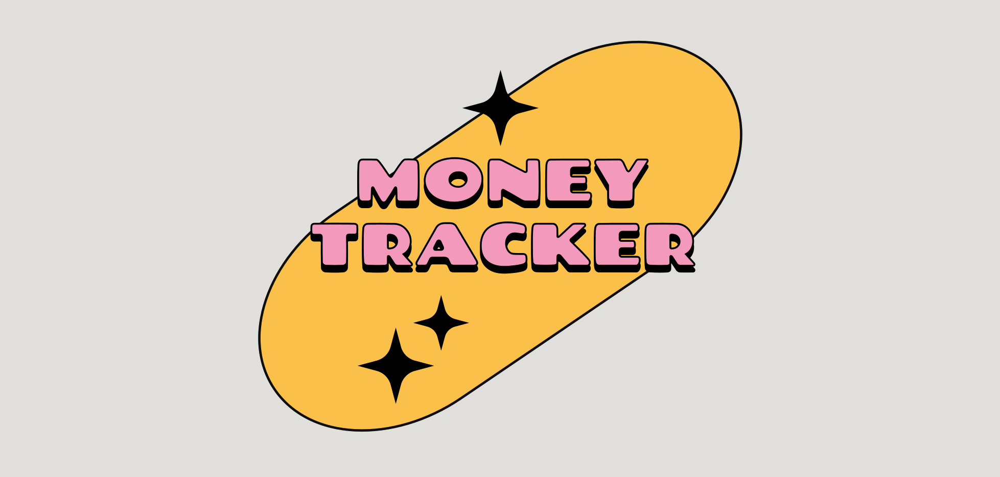

# Money Tracker



# Money Tracker

> 개인 자산 관리 시스템 <br/>
> 개발 기간 : 24.10 ~ 진행중

## 배포 주소

> https://m-tracker-six.vercel.app/

## 프로젝트 소개

여러분의 지갑 건강을 책임질 똑똑한 가계부 앱을 소개합니다!

수입과 지출을 쉽게 기록하고, 예산 관리부터 월별 비교까지 한눈에 볼 수 있어요.

PC나 스마트폰 어디서든 편하게 사용할 수 있으니, 이제 여러분의 돈관리 파트너로 함께해볼까요?

## 시작 가이드

로컬 실행

```bash
npm install
npm run dev
```

---

## Stacks 🛠️


---

## 화면 구성

## 주요 기능

### ⭐️ 회원가입, 로그인
### ⭐️ 월별 수입/지출/이체 항목 카테고리별 입력
* 카테고리 항목별 입력 및 입력시 계산기 UI 제공
### ⭐️ 월별 수입/지출 통계 제공
* 수입 : 카테고리별 수입 합계 표시 & 지난달과 비교
* 지출 : 카테고리별 예산 대비 지출비율 그래프로 표시

---

## 아키텍쳐

### 디렉토리 구조
